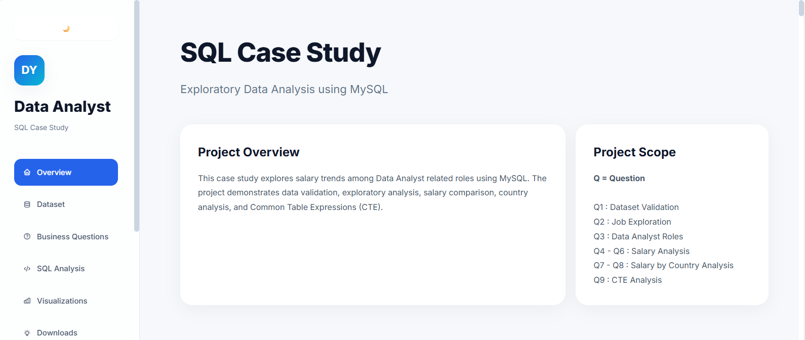

# SQL Case Study

A SQL case study that explores salary trends among Data Analyst–related roles using MySQL.

The project showcases data validation, exploratory data analysis, salary comparison, country-based analysis, and Common Table Expressions (CTEs) to answer business questions and generate meaningful insights through SQL.

---

## Live Demo

Visit the project documentation website:

👉 https://good-pastel.github.io/SQL-case-study/

---

## 📸 Preview

---

# 📖 Table of Contents

- [Technologies](#-technologies)
- [Case Studies](#case-studies)
- [SQL Concepts Covered](#sql-concepts-covered)
- [Project Overview](#-project-overview)
- [Learning Objectives](#learning-objectives)
- [Author](#author)

---

## 💻 Technologies

- SQL
- MySQL
- HTML5
- CSS3
- JavaScript
- Chart.js
- Responsive Design

---

## Case Studies

This project contains several SQL business scenarios, including:

- Data Exploration
- Data Filtering
- Sorting Records
- Aggregate Functions
- GROUP BY
- JOIN Operations
- Common Table Expressions (CTE)
- Business Reporting
- Data Analysis

---

## SQL Concepts Covered

### Data Retrieval

- SELECT
- DISTINCT
- WHERE
- ORDER BY
- LIMIT

### Data Aggregation

- COUNT()
- SUM()
- AVG()
- GROUP BY

### Joins

- LEFT JOIN

### Advanced SQL

- Common Table Expressions (CTE)

---

## 📝 Project Overview

Each case study follows a structured approach:

1. Business Problem
2. SQL Solution
3. Query Explanation
4. Output
5. Business Insight

This structure helps readers understand not only **how** a query works, but also **why** it is used to solve a specific business problem.

---

## Learning Objectives

This project was built to practice:

- SQL Fundamentals
- Business Data Analysis
- Problem Solving
- Analytical Thinking
- Technical Documentation

---

## Author

**Devi Yolanda**

Technical Writer • SQL Learner • Aspiring Data Analytics
